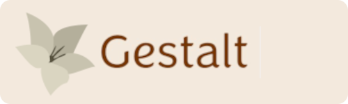

<p align="center">
  
</p>

Welcome to the Gestalt
======================

Gestalt is a user-friendly cryptography library designed for developers who want to seamlessly integrate cryptographic functions into their projects. 

Our goal is to provide a straightforward and intuitive interface for implementing essential cryptographic operations without the hassle associated with more complex libraries.

## Table of Contents

 - [Building Gestalt](#building-gestalt)
   - [CMake](#cmake)
 - [Supported Algorithms](#supported-algorithms)
 - [Usage](#usage)
 - [Development](#development)
 - [Documentation](#documentation)
 - [License](#license)
 - [Support](#support)
 - [Contributing](#contributing)
 - [Legalities](#legalities)


## Building Gestalt

To get started, check out our [website]() and [examples](). Whether you're a experienced developer or new to cryptography, Gestalt is here to make cryptography accessible and hassle-free.

### CMake

You can include Gestalt in your CMake project by using 'FetchContent`:

1. **Include `FetchContent` in your `CMakeLists.txt`**:

    ```cmake
    cmake_minimum_required(VERSION 3.16.3)
    project(Project)

    include(FetchContent)

    FetchContent_Declare(
      Gestalt
      GIT_REPOSITORY https://github.com/HLRichardson-Git/Gestalt.git
      GIT_TAG main
    )

    FetchContent_MakeAvailable(Gestalt)
    add_executable(MyExecutable main.cpp)
    target_include_directories(MyExecutable PRIVATE ${MPIR_INCLUDE_DIR})
    target_link_libraries (MyExecutable PRIVATE 
        Gestalt 
        ${MPIR_LIBRARY}
        gmp
    )
    ```

2. **Build your project**:

    ```sh
    mkdir build
    cd build
    cmake ..
    cmake --build .
    ```

3. **Run the tests** (optional but recommended):

    ```sh
    ./_deps/gestalt-build/tests/Debug/tests.exe
    ```

By using the `FetchContent` module, Gestalt and its dependencies will be automatically downloaded and made available to your project. You can then link against it as shown in the example above.

## Supported Algorithms

To see more about the supported algorithms check out our [website]() and [examples]().

| Algorithm        | Type                 | Description                                                            |
|------------------|----------------------|------------------------------------------------------------------------|
| AES          | Symmetric Encryption | Advanced Encryption Standard                         |
| SHA-1          | Hash Function        | Secure Hash Algorithm                              |
| SHA-2          | Hash Function        | Secure Hash Algorithm                              |
| HMAC-SHA1      | Message Authentication Code | HMAC using SHA-256                                                    |
| HMAC-SHA2      | Message Authentication Code | HMAC using SHA-512                                                    |
| ECDSA              | Asymmetric Encryption| Elliptic Curve Signature Algorithm                                            |
| ECDH              | Asymmetric Encryption| Elliptic Curve Shared Secret computation                                            |

*More algorithms are being implemented very often, see [open issues](https://github.com/HLRichardson-Git/Gestalt/issues) to see algorithms in devlopment*

## Usage

Using Gestalt is meant to be a simple as possible for developers to quickly use cryptographic algorithms. For more examples, check out our [examples]().

### Example using AES CBC:

```cpp
#include <gestalt/aes.h>
#include <iostream>

int main() {
    std::string key = "10a58869d74be5a374cf867cfb473859"; // 128-bit key
    std::string message = "Hello, Gestalt!";
    std::string ciphertext = aesEncryptECB(message, key);

    std::cout << "AES-CBC-128: " << ciphertext << std::endl;

    return 0;
}
```

### Example using SHA2-256:

```cpp
#include <gestalt/sha2.h>
#include <iostream>

int main() {
    std::string message = "Hello, Gestalt!";
    std::string hash = hashSHA256(message);

    std::cout << "SHA2-256: " << hash << std::endl;

    return 0;
}
```

### Example using ECDSA with P-256:

```cpp
#include <gestalt/ecdsa.h>
#include <iostream>

int main() {
    std::string privateKey = "0xC9AFA9D845BA75166B5C215767B1D6934E50C3DB36E89B127B8A622B120F6721";
    ECDSA ecdsa(StandardCurve::P256, privateKey);

    std::string message = "Hello, Gestalt!";

    Signature signature = ecdsa.signMessage(message, k_value);

    std::cout << "Signature r: " << signature.r << std::endl;
    std::cout << "Signature s: " << signature.s << std::endl;

    return 0;
}
```

## Contributing

Gestalt is an open-source project where contribution is encouraged, having
a local copy of the git repository with the entire project history gives you 
much more insight into the code base.

A local copy of the Git Repository can be obtained by cloning it from

    git clone https://github.com/HLRichardson-Git/Gestalt.git

Documentation
=============

README Files
------------

Presently we only have this singular README file. But as the project grows
more will be published for specific topics for clarification that is out
of the scope of this.

The Gestalt Guide
-----------------
WIP

License
=======

Gestalt is licensed under the MIT License, which means that
you are free to use, copy, modify, merge, publish, distribute, sublicense, and/or sell
copies of the Software.

See the [LICENSE](LICENSE) file for more details.

Support
=======

WIP

Contributing
============

If you are interested and willing to contribute to the Gestalt project,
please take a look at the [CONTRIBUTING](CONTRIBUTING.md) file.

Legalities
==========

A number of nations restrict the use or export of cryptography. If you are
potentially subject to such restrictions, you should seek legal advice before
attempting to develop or distribute cryptographic code.

Copyright
=========

Copyright (c) 2023-2024 The Gestalt Project Authors.

All rights reserved.
